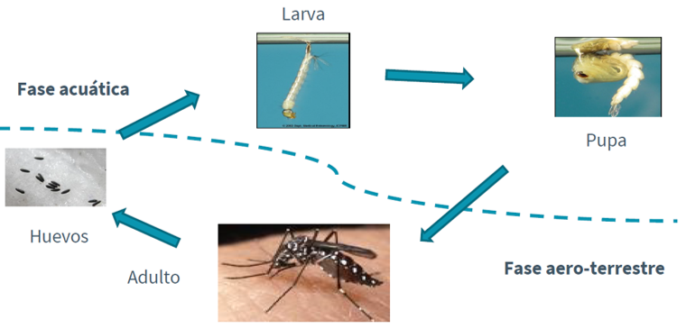
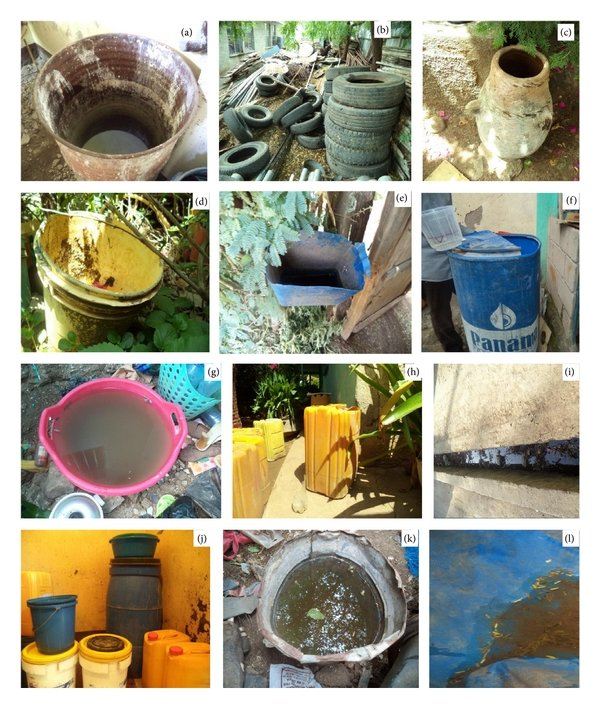
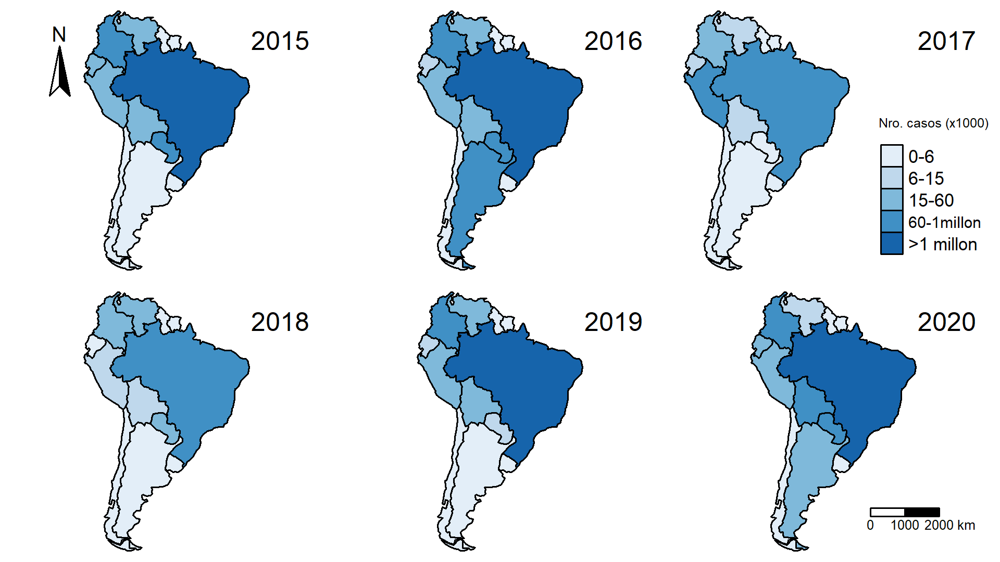
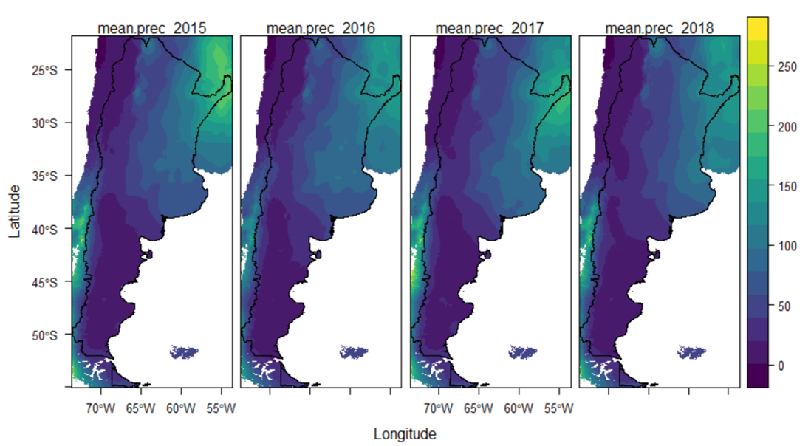
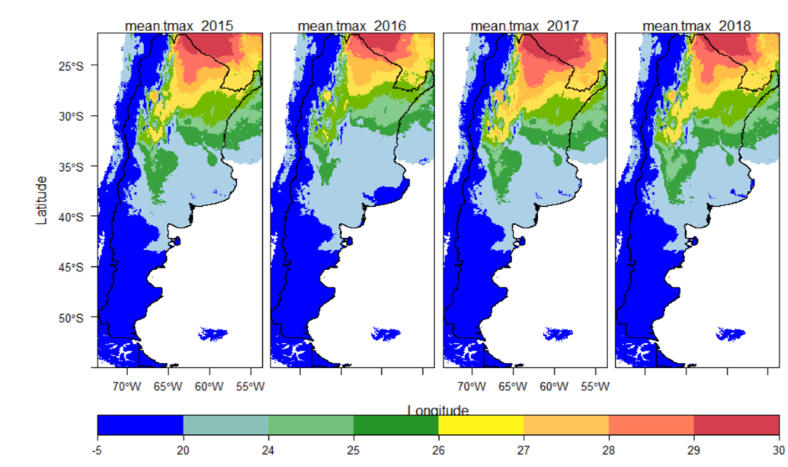
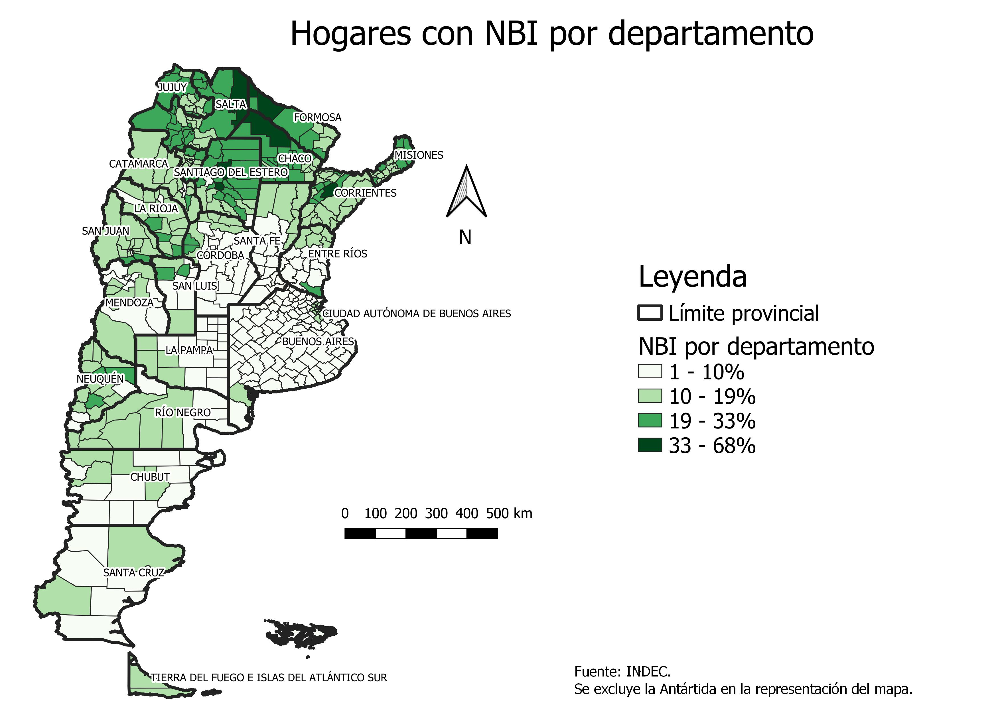

```{r setup, include = FALSE}
options(htmltools.dir.version = FALSE)
library(knitr)
library(tidyverse)
library(xaringanExtra)
# set default options
opts_chunk$set(echo=FALSE,
               collapse = TRUE,
               fig.width = 7.252,
               fig.height = 4,
               dpi = 300)
xaringanExtra::use_tile_view()
xaringanExtra::use_clipboard()
xaringanExtra::use_webcam(width = 210, height = 220)
xaringanExtra::use_broadcast()
xaringanExtra::use_share_again()
xaringanExtra::style_share_again(
  share_buttons = c("twitter", "linkedin", "pocket")
)
```


# Introducción del dengue en la Argentina

- _Aedes aegypti_ es originario del oeste de África y fue introducido en América probablemente en los barcos de esclavos y en los containers de agua (Fischer et al. 2017).

--

- Los primeros registros de _A. aegypti_ en Argentina son de principios de siglo XX. 

--

- Fuerte campaña de erradicación entre 1940-1960 y se oficializa en 1963.

--

- Desde 1997 ha presentado en forma de brotes esporádicos en algunos puntos del norte del país (Vezzani and Carbajo 2008).

--

- En 2009 ocurrió la primera gran y muy extensa epidemia de dengue, que abarcó 14 jurisdicciones del país y casi 25 mil casos confirmados (Seijo et al. 2009)

--

- En 2016 se produjo uno de los brotes mas importantes en Argentina, con casi 40 mil casos confirmados autóctonos en 15 jurisdicciones junto con la co-circulación de los virus Zika y chikungunya, otras dos enfermedades transmitidas por mosquitos (en espacial _Aedes aegypti_ y _Aedes albopictus_)

--

- En 2019-2020, se registraron al Sistema Nacional de Vigilancia de la Salud 56.293 casos de dengue (entre probables y confirmados por laboratorio o nexo epidemiológico) sin antecedente de viaje.

---
#Situación a actual 

Cada año se presentan cerca de 390 millones de casos de dengue en el mundo, de los cuales 500 mil corresponden a dengue grave con alrededor de 25 mil muertes. 

## En América ha pasado a ser un problema muy grave y prioritario para la **salud pública** desde 1980.

## Se ha registrado en Argentina 2 de los 4 serotipos (DEN1 Y DEN4)

---

#Ciclo de vida de _Aedes aegypti_

.center[]

---

# ¿ Qué favorece la proliferación del dengue?

- Antropofilico

--

- Huevos de resistencia

--

- Radio de acción (50-100m)

--

- Estrategia reproductiva de ingestas múltiples
--

- Pone huevos en varios recipientes, aseguando que parte de su descendencia sobreviva y se reproduzca

--

- Containers y recipientes

.center[]
---
# Cambio del número de casos de dengue 

.center[]

.footnote[ Fuente: Organización Panamericana de la Salud (OPS)]
---
# Cambio en la prep. media anual

.center[]

.footnote[ Fuente: Worldclim]
---

#Cambio en la temperatura máx. anual

.center[]

.footnote[ Fuente: Worldclim]
---

class: inverse, middle, center

# Pregunta de investigación `r icon::fa("bell")`

###Analizar los cambios espaciotemporales de la incidencia del dengue en Argentina (2015-2020) en relación con los factores ambientales y socioeconómicos que la determinan.

--

### Proyección de los casos de dengue según los diferentes escenarios del cambio climático.

--

- ¿ La influencia de los factores ambientales y socioeconómicos cambia en el período 2015-2020?

- ¿ Hay regiones del país con mayor riesgo de aumento de casos de dengue?

---
class: top

## Variables ambientales y factores socioeconómicos

--

.pull-left[ V. ambientales

- Temperatura máx. (estacional?)
- Temperatura mín. (estacional?)
- Temperatura media (estacional?)
- Pp. medias mensuales (estacional?)
- Humedad relativa
- NDVI

]

--

.pull-right[ 
V. socioeconomicas

- Distancia a cementerios
- Suministros de agua potable
- Densidad poblacional
- Ingresos mensuales
- NBI

]

---

# Mapa Necesidades básicas insatisfechas (NBI)

.center[]

---

# Hasta el momento...

--

Pedido de los registros de casos de dengue al Ministerio de Salud de las diferentes localidades de la Argentina.

--

Revisión de los boletines epidemiológicos

--

Búsqueda y recolección de datos demográficos y socioeconómicos del INDEC (del censo del 2010 y de las proyecciones)

--

Posible contacto en la CONAE


---

#Bibliografía

- Fischer, S. et al. 2017. Long-Term spatio-Temporal dynamics of the mosquito Aedes aegypti in temperate Argentina. - Bull. Entomol. Res. 107: 225–233.

- Seijo, A. et al. 2009. Brote de dengue autóctono en el área metropolitana Buenos Aires. - Med. (Buenos 69: 593–600.

- Vezzani, D. and Carbajo, A. E. 2008. Aedes aegypti, Aedes albopictus, and dengue in Argentina: Current knowledge and future directions. - Mem. Inst. Oswaldo Cruz 103: 66–74.